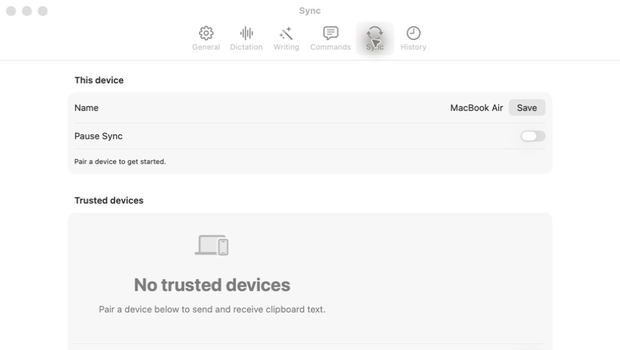
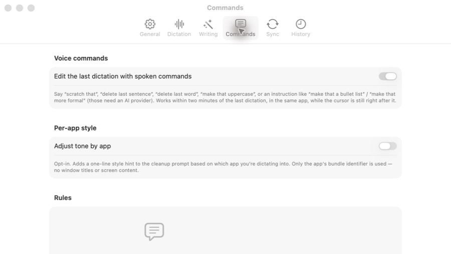

# Design recheck

Latest local commit: caf7a4c, “Give the Mac app a design system and an interactive recording Stage.” The reviewed Mac UI source files retain the same modification times as the first review. The Xcode Debug executable is still the 19:16:26 build; the installed release is still the older 15:47:52 build.

Fresh visual checks at the existing 900 × 508 Settings window confirm the two main layout findings remain:

1. **Sync — unresolved.** The initial viewport contains device settings and a large empty state. Pairing remains below the first screen.

2. **Commands — unresolved.** Supporting paragraphs and a large empty state push rule creation below the initial viewport. Help text remains small and muted; contrast was not measured.

Both screenshots were captured during this recheck, saved, reopened, and inspected. This was a targeted visual recheck, not a repeat functional or accessibility audit. Recording and the remaining setup flow were not tested.

Next recommended change: compact these two empty states and put their primary actions directly inside them.
