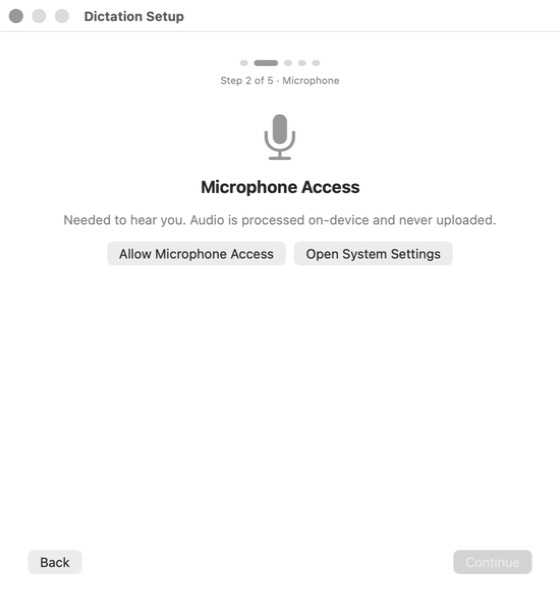
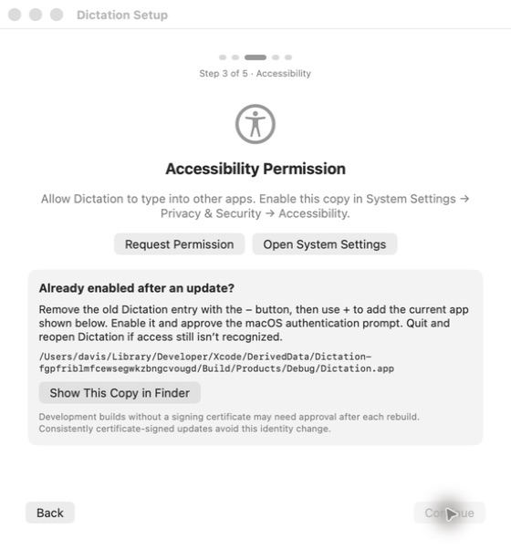
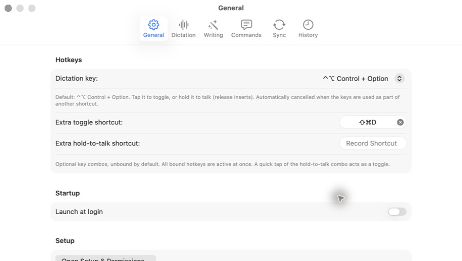
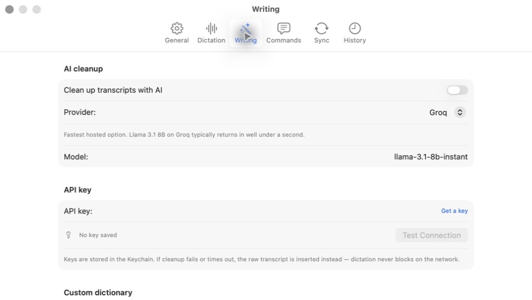
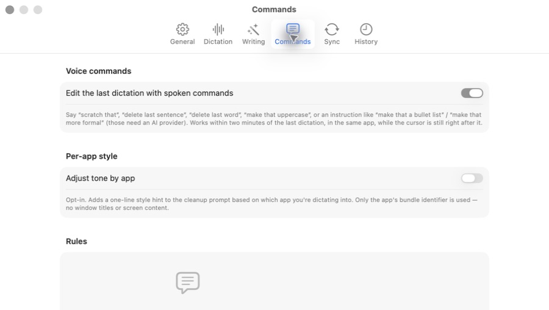
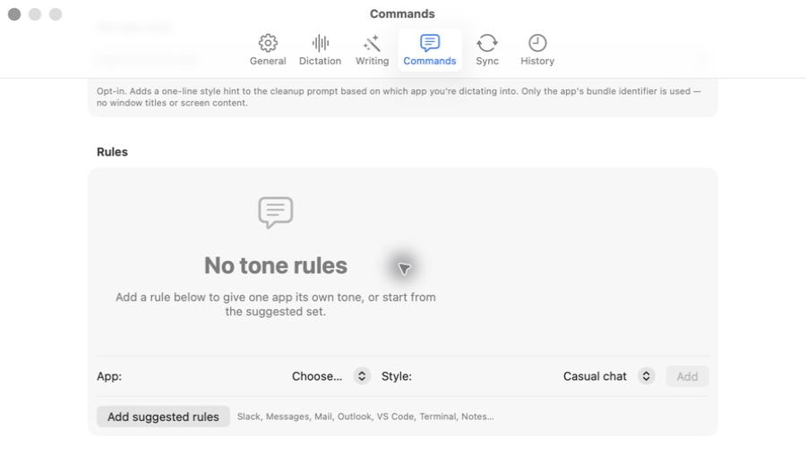
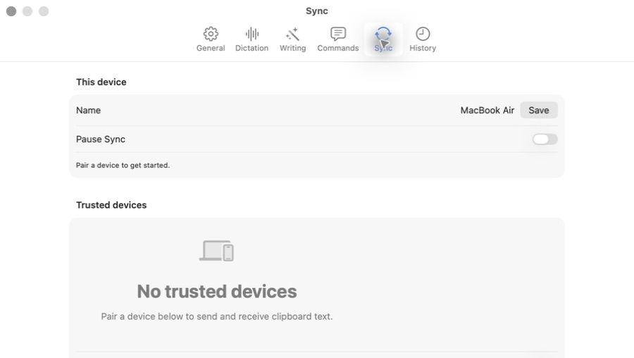
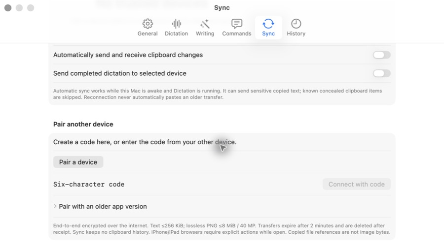
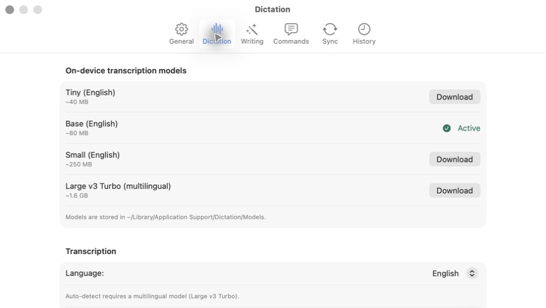
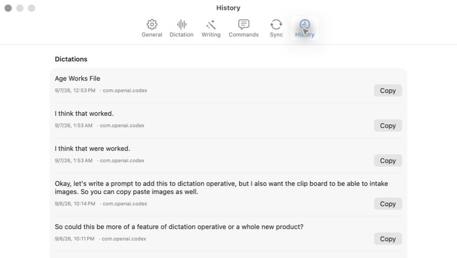

# Native Mac design review — 7 September 2026

The native tabs, consistent grouped forms, and explicit status labels give the new design a coherent foundation. The highest-value next pass is information hierarchy: bring first-use actions into view, shrink empty states, and shorten supporting copy.

Scope: current Xcode Debug app, with setup at 560 × 602 and the existing Settings window at 900 × 508. These are current-run captures, opened and checked after saving. The installed release predates the new design. No product source was edited.

## Priority findings

- **High — Pairing is hidden below the first screen.** In steps 7–8, the unpaired Sync screen prioritizes naming, pausing, a large empty state, and automation settings above pairing. Put “Pair a device” directly inside a compact empty state, with entering a code as a clear alternate path. Explain unavailable automation until a device is paired.
- **Medium — Setup presents competing actions.** Steps 1–2 give Request/Allow and Open System Settings equal button treatment. Make the normal next step prominent; present the fallback as secondary help. Collapse the long update-recovery instructions under “Permission already enabled?”
- **Medium — Empty rules consume too much space.** Steps 5–6 require scrolling to reach rule creation. Replace the oversized empty card with a short message adjacent to App, Style, and Add. Explain that rules take effect when Adjust tone by app is enabled.
- **Medium — Important guidance is small and faint.** Steps 3–9 rely on caption-sized gray paragraphs for shortcut behavior, privacy, battery use, and feature prerequisites. Promote essential instructions to readable body text, shorten them, and put implementation details behind help. Contrast is a visual risk, not a measured failure.
- **Medium — Writing needs clearer dependency messaging.** Step 4 shows editable model/key controls with AI cleanup off. Configuration while disabled can be useful, but explicitly say settings will apply when cleanup is enabled; explain that the custom dictionary depends on AI cleanup.
- **Low — History exposes internal app identifiers.** Step 10 shows bundle identifiers in metadata. Display readable app names and retain identifiers only in detail/help. The text-first layout and per-entry Copy controls are otherwise clear.

## Captured steps

1. **Microphone setup — needs hierarchy polish.** Clear title and numbered progress; competing buttons and substantial unused space.

2. **Accessibility setup — needs simplification.** Purpose is explained, but troubleshooting dominates before the user encounters a problem. The permission requirement prevented progressing through the remaining setup flow.

3. **General — sound structure, dense guidance.** Logical groups and recognizable controls. Key instructions are caption-sized, and Setup begins below the viewport.

4. **Writing — sound grouping, unclear disabled-feature relationship.** Provider, key status, and connection test are grouped well. Configuration remains visible with AI cleanup off; dictionary controls start below the viewport.

5. **Commands entry — needs density reduction.** The two feature switches are easy to find. Long descriptions and the empty state hide rule creation.

6. **Commands rules after scrolling — usable controls, oversized empty state.** App, Style, Add, and suggested rules form a understandable path once reached. The empty-state graphic and copy consume most of the available space.

7. **Sync entry — highest-priority usability issue.** “Pair a device to get started” is visible, but the action itself is below the first screen.

8. **Sync pairing after scrolling — usable, too much supporting detail.** Creation and code-entry paths are present. Encryption, transfer limits, expiry, browser constraints, and clipboard implementation details are compressed into one faint paragraph.

9. **Dictation — strongest settings pane.** Model names, sizes, Download controls, and the Active label are easy to scan. A short recommended-use description would help distinguish model choices.

10. **History — clear basic utility, metadata needs polish.** Transcripts lead and Copy is easy to find. Use app names instead of bundle identifiers; search or filtering may be useful as this list grows.

## Accessibility and evidence limits

The accessibility tree exposes named toolbar buttons, headings, switches, and the setup step label. Native semantics are a useful foundation, but this is not a complete VoiceOver or keyboard audit. Small supporting text and muted controls warrant focused contrast and readability testing in both appearances.

The recording Stage was inspected in source only: it adds visible Stop & Insert, Cancel, and state-specific recovery controls. Its repeating recording-dot animation has no Reduce Motion check in LiveDot. Verify that preference and keyboard/VoiceOver alternatives for the non-key floating panel in a separate functional pass.

Not verified: the recording Stage visually, microphone recording, actual insertion, remaining onboarding steps, pair approval or transfers, credential validation, dark mode, minimum window sizing, full keyboard navigation, and measured contrast. No permission or security changes were made by the reviewer. The new Debug build was opened for this review and remains available; the installed release was not replaced.
